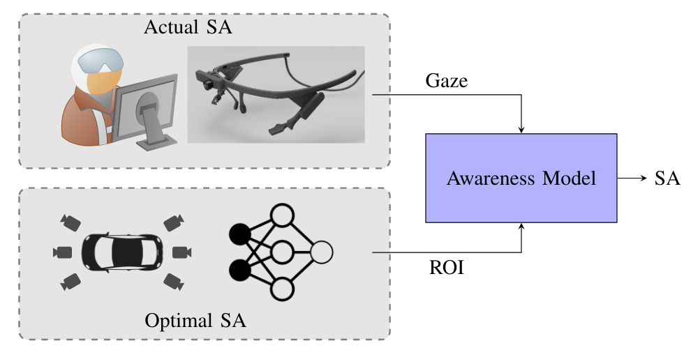

# Driver Awareness

[](https://github.com/hofbi/driver-awareness)
[](https://github.com/hofbi/driver-awareness)
[](https://github.com/psf/black)

Measure the driver situation awareness based on eye tracking data.



## Paper

If you use this code please cite our paper.

*Measuring Driver Situation Awareness Using Region-of-Interest Prediction and Eye Tracking, Markus Hofbauer, Christopher B. Kuhn, Lukas Püttner, Goran Petrovic, Eckehard Steinbach; ISM 2020* [[PDF](https://www.researchgate.net/publication/345241621_Measuring_Driver_Situation_Awareness_Using_Region-of-Interest_Prediction_and_Eye_Tracking)]

```tex
@inproceedings{hofbauer_2020,
    title = {Measuring Driver Situation Awareness Using Region-of-Interest Prediction and Eye Tracking},
    booktitle = {22nd IEEE International Symposium on Mulitmedia},
    publisher = {IEEE},
    address = {Naples, Italy},
    author = {Hofbauer, Markus and Kuhn, Christopher B. and Püttner, Lukas and Petrovic, Goran and Steinbach, Eckehard},
    month = {Dec},
    year = {2020},
    pages = {1--5},
}
```

## Setup

This is purely implemented in Python 3 and so far has been tested on

| OS  | ROS Version |
| --- | ----------- |
| Ubuntu 20.04 | Noetic |

1. Setup [TELECARLA](https://github.com/hofbi/telecarla/blob/master/README.md#setup)
1. Clone this repository into the workspace's `src` folder with `git clone https://github.com/hofbi/driver-awareness.git`
1. Run the install script: `./install.sh` **NOTE** You have to restart the computer after running this script.
1. Install the python requirements: `pip3 install -r requirements.txt`
1. Build the workspace: `catkin build`
1. Source your workspace `source ~/catkin_ws_teleop/devel/setup.<your_shell>`

## Run

* See the main module for running the entire application: [awareness_detector](awareness_detector).
* See the [gaze_detector](gaze_detector) for details on using the eye tracking device.

## Development

To install the additional tools required for the development, call

```shell
python3 -m pip install -r requirements.txt
sudo snap install shfmt
```

### pre-commit git hooks

We use [pre-commit](https://pre-commit.com/) to manage our git pre-commit hooks.
`pre-commit` is automatically installed from `requirements.txt`.
To set it up, call

```sh
git config --unset-all core.hooksPath  # may fail if you don't have any hooks set, but that's ok
pre-commit install --overwrite
```

#### Usage

With `pre-commit`, you don't use your linters/formatters directly anymore, but through `pre-commit`:

```sh
pre-commit run --file path/to/file1.cpp tools/second_file.py  # run on specific file(s)
pre-commit run --all-files  # run on all files tracked by git
pre-commit run --from-ref origin/master --to-ref HEAD  # run on all files changed on current branch, compared to master
pre-commit run <hook_id> --file <path_to_file>  # run specific hook on specific file
```
