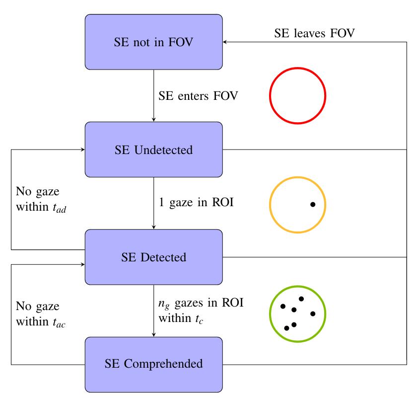
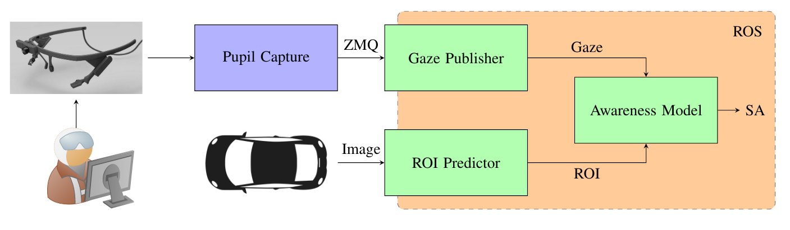
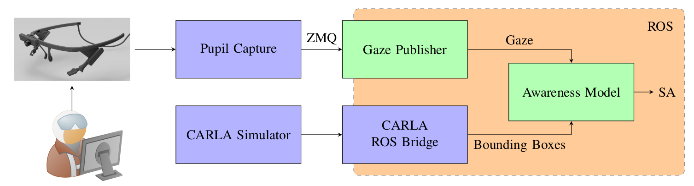

# Awareness Detector

The awareness detector estimates the driver SA score based on gaze data and target SA and publishes it to ROS. The package handles the detection and comprehension of relevant situation elements.



Currently there are 2 definitions for the optimal situation elements.

* **Awareness Model**
* **CARLA Awareness Model**

## Awareness Model

* The awareness model uses gaze data from an eye-tracking device and region of interest (ROI) messages in the current camera frame.
* The ROI messages can be received from a data recording in form of a bag file (manually labeled data) or from a ROI predictor.



```shell
roslaunch awareness_detector awareness_model.launch
```

## CARLA Awareness Model

* The CARLA awareness model uses gaze data from an eye-tracking device and he ground truth data of pedestrians and cars from the CARLA Simulator.
* Using the 3D position of the cars and pedestrians in CARLA and the camera images of the ego vehicle, the position of the objects in the current camera frame can be calculated.
* The resulting 2D position act as the optimal SA regions.
* This is a good solution for fast prototyping to remove the dependency of machine learning predictions.



```shell
roslaunch awareness_detector carla_awareness_model.launch
```

## Evaluation with the Awareness Model

Calibrate Pupil Core using Pupil Capture using the remote calibration script from the gaze_detector package.

```shell
roslaunch gaze_detector remote_calibration.launch pupil_ip:=<IP_PUPIL_CAPTURE>
```

Start the awareness detection using recorded rosbags with ROIs using

```shell
roslaunch awareness_detector evaluation_rosbag.launch pupil_ip:=<IP_PUPIL_CAPTURE> filename_rosbag:=<ROSBAG_PATH>
```

or the awareness detection with the CARLA simulator using

```shell
roslaunch awareness_detector evaluation.launch pupil_ip:=<IP_PUPIL_CAPTURE>
```

### Possible Arguments

| Parameter | Values | Description |
| ------ | ------ | ------ |
| compress | False/True | Apply jpeg compression to images |
| image_quality | 0-100 | Choose jpeg image quality if compression is true |
| visualize_debug | False/True | Visualize ROIs in the image and their detection state |
| record | False/True | Record results to a rosbag file |

## Util

Some further utility scripts

### Extract SA from recorded bags

Execute the following command to extract the SA from rosbags containing SA messages. This outputs a csv file with the content of the rosbag SA messages.

```shell
python3 util/extract_sa.py -i INPUT_DIR -o OUPUT_DIR
```

### Extract the frames as images from a rosbag

Output folder, image topic and applied compression can be configured using launch parameters.

```shell
roslaunch awareness_detector extract_frames_rosbag.launch input_rosbag:=test.bag
```
